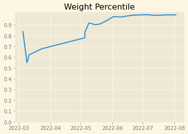
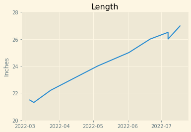
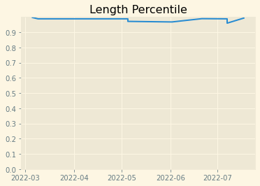
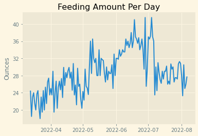
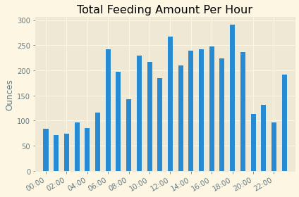
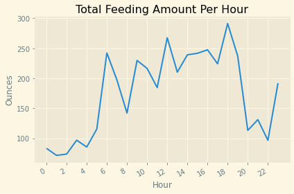
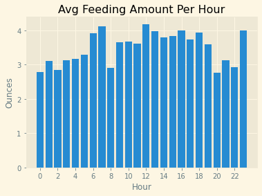
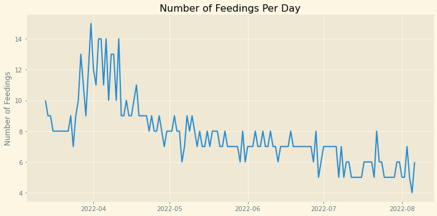
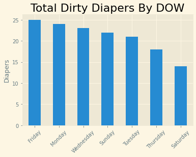

# My Baby's Development

## Setup

##### Import Data & modules


```python
import pandas as pd
import matplotlib.pyplot as plt
import matplotlib.dates as mdates
from matplotlib import style
import numpy as np
import datetime
from matplotlib.dates import DateFormatter

df = pd.read_csv('./HatchBaby_2022-03-05_2022-08-06.csv')
df.head(3)
```


<div>
<style scoped>
    .dataframe tbody tr th:only-of-type {
        vertical-align: middle;
    }

    .dataframe tbody tr th {
        vertical-align: top;
    }

    .dataframe thead th {
        text-align: right;
    }
</style>
<table border="1" class="dataframe">
  <thead>
    <tr style="text-align: right;">
      <th></th>
      <th>Baby Name</th>
      <th>Start Time</th>
      <th>End Time</th>
      <th>Activity</th>
      <th>Amount</th>
      <th>Percentile</th>
      <th>Duration</th>
      <th>Info</th>
      <th>Notes</th>
      <th>Unnamed: 9</th>
    </tr>
  </thead>
  <tbody>
    <tr>
      <th>0</th>
      <td>Elisha Jian Park</td>
      <td>03/05/2022 0:00 AM</td>
      <td>03/05/2022 0:00 AM</td>
      <td>Weight</td>
      <td>8.18</td>
      <td>0.8411</td>
      <td>NaN</td>
      <td>NaN</td>
      <td>Measured by Nurse</td>
      <td>NaN</td>
    </tr>
    <tr>
      <th>1</th>
      <td>Elisha Jian Park</td>
      <td>03/05/2022 0:00 AM</td>
      <td>03/05/2022 0:00 AM</td>
      <td>Length</td>
      <td>21.5</td>
      <td>0.9983</td>
      <td>NaN</td>
      <td>NaN</td>
      <td>Measured by Nurse</td>
      <td>NaN</td>
    </tr>
    <tr>
      <th>2</th>
      <td>Elisha Jian Park</td>
      <td>03/06/2022 0:00 AM</td>
      <td>03/06/2022 0:00 AM</td>
      <td>Weight</td>
      <td>7.875</td>
      <td>NaN</td>
      <td>NaN</td>
      <td>NaN</td>
      <td>Measured by Nurse</td>
      <td>NaN</td>
    </tr>
  </tbody>
</table>
</div>


##### Number of Rows


```python
len(df)
```


    1894


##### Data Types


```python
df.dtypes
```


    Baby Name      object
    Start Time     object
    End Time       object
    Activity       object
    Amount         object
    Percentile    float64
    Duration      float64
    Info           object
    Notes          object
    Unnamed: 9    float64
    dtype: object


##### Check For Nulls


```python
df.isnull().sum()
```


    Baby Name        1
    Start Time       0
    End Time         0
    Activity         0
    Amount           8
    Percentile    1864
    Duration       712
    Info           721
    Notes         1796
    Unnamed: 9    1894
    dtype: int64


##### Drop Unused Column


```python
df2 = df.drop(columns = 'Unnamed: 9')
df2.head(1)
```


<div>
<style scoped>
    .dataframe tbody tr th:only-of-type {
        vertical-align: middle;
    }

    .dataframe tbody tr th {
        vertical-align: top;
    }

    .dataframe thead th {
        text-align: right;
    }
</style>
<table border="1" class="dataframe">
  <thead>
    <tr style="text-align: right;">
      <th></th>
      <th>Baby Name</th>
      <th>Start Time</th>
      <th>End Time</th>
      <th>Activity</th>
      <th>Amount</th>
      <th>Percentile</th>
      <th>Duration</th>
      <th>Info</th>
      <th>Notes</th>
    </tr>
  </thead>
  <tbody>
    <tr>
      <th>0</th>
      <td>Elisha Jian Park</td>
      <td>03/05/2022 0:00 AM</td>
      <td>03/05/2022 0:00 AM</td>
      <td>Weight</td>
      <td>8.18</td>
      <td>0.8411</td>
      <td>NaN</td>
      <td>NaN</td>
      <td>Measured by Nurse</td>
    </tr>
  </tbody>
</table>
</div>


##### 'Activity' types


```python
print(df2['Activity'].unique())
```

    ['Weight' 'Length' 'Feeding' 'Diaper' 'Sleep' 'Pump']


##### 'Amount' has non-numeric values; find these values


```python
df2[df2['Amount'].isnull()]
```


<div>
<style scoped>
    .dataframe tbody tr th:only-of-type {
        vertical-align: middle;
    }

    .dataframe tbody tr th {
        vertical-align: top;
    }

    .dataframe thead th {
        text-align: right;
    }
</style>
<table border="1" class="dataframe">
  <thead>
    <tr style="text-align: right;">
      <th></th>
      <th>Baby Name</th>
      <th>Start Time</th>
      <th>End Time</th>
      <th>Activity</th>
      <th>Amount</th>
      <th>Percentile</th>
      <th>Duration</th>
      <th>Info</th>
      <th>Notes</th>
    </tr>
  </thead>
  <tbody>
    <tr>
      <th>504</th>
      <td>Elisha Jian Park</td>
      <td>04/12/2022 17:05 PM</td>
      <td>04/12/2022 18:00 PM</td>
      <td>Sleep</td>
      <td>NaN</td>
      <td>NaN</td>
      <td>0.916667</td>
      <td>NaN</td>
      <td>NaN</td>
    </tr>
    <tr>
      <th>508</th>
      <td>Elisha Jian Park</td>
      <td>04/12/2022 19:05 PM</td>
      <td>04/12/2022 20:18 PM</td>
      <td>Sleep</td>
      <td>NaN</td>
      <td>NaN</td>
      <td>1.216667</td>
      <td>NaN</td>
      <td>NaN</td>
    </tr>
    <tr>
      <th>863</th>
      <td>Elisha Jian Park</td>
      <td>05/08/2022 15:25 PM</td>
      <td>05/08/2022 16:10 PM</td>
      <td>Sleep</td>
      <td>NaN</td>
      <td>NaN</td>
      <td>0.750000</td>
      <td>NaN</td>
      <td>NaN</td>
    </tr>
    <tr>
      <th>891</th>
      <td>Elisha Jian Park</td>
      <td>05/10/2022 10:51 AM</td>
      <td>05/10/2022 12:21 PM</td>
      <td>Sleep</td>
      <td>NaN</td>
      <td>NaN</td>
      <td>1.500000</td>
      <td>NaN</td>
      <td>NaN</td>
    </tr>
    <tr>
      <th>906</th>
      <td>Elisha Jian Park</td>
      <td>05/10/2022 23:55 PM</td>
      <td>05/11/2022 1:40 AM</td>
      <td>Sleep</td>
      <td>NaN</td>
      <td>NaN</td>
      <td>1.750000</td>
      <td>NaN</td>
      <td>NaN</td>
    </tr>
    <tr>
      <th>907</th>
      <td>Elisha Jian Park</td>
      <td>05/11/2022 2:15 AM</td>
      <td>05/11/2022 2:56 AM</td>
      <td>Sleep</td>
      <td>NaN</td>
      <td>NaN</td>
      <td>0.683333</td>
      <td>NaN</td>
      <td>NaN</td>
    </tr>
    <tr>
      <th>923</th>
      <td>Elisha Jian Park</td>
      <td>05/12/2022 3:50 AM</td>
      <td>05/12/2022 5:25 AM</td>
      <td>Sleep</td>
      <td>NaN</td>
      <td>NaN</td>
      <td>1.583333</td>
      <td>NaN</td>
      <td>NaN</td>
    </tr>
    <tr>
      <th>924</th>
      <td>Elisha Jian Park</td>
      <td>05/12/2022 6:10 AM</td>
      <td>05/12/2022 8:40 AM</td>
      <td>Sleep</td>
      <td>NaN</td>
      <td>NaN</td>
      <td>2.500000</td>
      <td>NaN</td>
      <td>NaN</td>
    </tr>
  </tbody>
</table>
</div>


```python
#print(df2[df2['Amount'].str.match('\d+') == False]['Amount'].unique())

df_amount_nn = df2[df2['Amount'].str.match('\d+') == False]
print(df_amount_nn['Amount'].unique())
```

    ['Wet + Dirty' 'Wet' 'Dirty']


##### Convert Non-numeric 'Amount' to Float


```python
#df_amount_nn['Amount'] = df_amount_nn['Amount'].astype(float)
```

##### Add 'Date' Column


```python
df2['Date'] = pd.to_datetime(df2['Start Time'], format = '%m/%d/%Y %H:%M %p').dt.floor('d')
#df2['Date'] = pd.to_datetime(df2['Start Time'], format = '%m/%d/%Y %H:%M %p').dt.date
```

##### Add 'Month' Column


```python
df2['Month'] = pd.to_datetime(df2['Start Time'], format = '%m/%d/%Y %H:%M %p').dt.month
```

##### Add 'DOW' Column


```python
df2['DOW #'] = pd.to_datetime(df2['Start Time'], format = '%m/%d/%Y %H:%M %p').dt.dayofweek
df2['DOW'] = pd.to_datetime(df2['Start Time'], format = '%m/%d/%Y %H:%M %p').dt.day_name()
```

##### Add 'Time' Column


```python
df2['Time'] = pd.to_datetime(df2['Start Time'], format = '%m/%d/%Y %H:%M %p').dt.time
```

##### Add 'Hour' Column


```python
df2['Hour(int)'] = pd.to_datetime(df2['Start Time'], format = '%m/%d/%Y %H:%M %p').dt.hour

#df2['Hour(dt)'] = pd.to_datetime(df2['Start Time'], format = '%m/%d/%Y %H:%M %p').dt.floor('H').dt.time
df2['Hour(dt)'] = pd.to_datetime('2022-01-01') + pd.to_timedelta(df2['Hour(int)'], unit='H')
df2['Hour(dt)'] = pd.to_datetime(df2['Hour(dt)'])
```

##### Sort


```python
df2 = df2.sort_values('Start Time', ascending=True)

df2.head(-5)
```


<div>
<style scoped>
    .dataframe tbody tr th:only-of-type {
        vertical-align: middle;
    }

    .dataframe tbody tr th {
        vertical-align: top;
    }

    .dataframe thead th {
        text-align: right;
    }
</style>
<table border="1" class="dataframe">
  <thead>
    <tr style="text-align: right;">
      <th></th>
      <th>Baby Name</th>
      <th>Start Time</th>
      <th>End Time</th>
      <th>Activity</th>
      <th>Amount</th>
      <th>Percentile</th>
      <th>Duration</th>
      <th>Info</th>
      <th>Notes</th>
      <th>Date</th>
      <th>Month</th>
      <th>DOW #</th>
      <th>DOW</th>
      <th>Time</th>
      <th>Hour(int)</th>
      <th>Hour(dt)</th>
    </tr>
  </thead>
  <tbody>
    <tr>
      <th>0</th>
      <td>Elisha Jian Park</td>
      <td>03/05/2022 0:00 AM</td>
      <td>03/05/2022 0:00 AM</td>
      <td>Weight</td>
      <td>8.18</td>
      <td>0.8411</td>
      <td>NaN</td>
      <td>NaN</td>
      <td>Measured by Nurse</td>
      <td>2022-03-05</td>
      <td>3</td>
      <td>5</td>
      <td>Saturday</td>
      <td>00:00:00</td>
      <td>0</td>
      <td>2022-01-01 00:00:00</td>
    </tr>
    <tr>
      <th>1</th>
      <td>Elisha Jian Park</td>
      <td>03/05/2022 0:00 AM</td>
      <td>03/05/2022 0:00 AM</td>
      <td>Length</td>
      <td>21.5</td>
      <td>0.9983</td>
      <td>NaN</td>
      <td>NaN</td>
      <td>Measured by Nurse</td>
      <td>2022-03-05</td>
      <td>3</td>
      <td>5</td>
      <td>Saturday</td>
      <td>00:00:00</td>
      <td>0</td>
      <td>2022-01-01 00:00:00</td>
    </tr>
    <tr>
      <th>2</th>
      <td>Elisha Jian Park</td>
      <td>03/06/2022 0:00 AM</td>
      <td>03/06/2022 0:00 AM</td>
      <td>Weight</td>
      <td>7.875</td>
      <td>NaN</td>
      <td>NaN</td>
      <td>NaN</td>
      <td>Measured by Nurse</td>
      <td>2022-03-06</td>
      <td>3</td>
      <td>6</td>
      <td>Sunday</td>
      <td>00:00:00</td>
      <td>0</td>
      <td>2022-01-01 00:00:00</td>
    </tr>
    <tr>
      <th>3</th>
      <td>Elisha Jian Park</td>
      <td>03/09/2022 0:00 AM</td>
      <td>03/09/2022 0:00 AM</td>
      <td>Length</td>
      <td>21.3</td>
      <td>0.9884</td>
      <td>NaN</td>
      <td>NaN</td>
      <td>Measured by Nurse</td>
      <td>2022-03-09</td>
      <td>3</td>
      <td>2</td>
      <td>Wednesday</td>
      <td>00:00:00</td>
      <td>0</td>
      <td>2022-01-01 00:00:00</td>
    </tr>
    <tr>
      <th>4</th>
      <td>Elisha Jian Park</td>
      <td>03/09/2022 0:00 AM</td>
      <td>03/09/2022 0:00 AM</td>
      <td>Weight</td>
      <td>7.53</td>
      <td>0.5487</td>
      <td>NaN</td>
      <td>NaN</td>
      <td>Measured by Nurse</td>
      <td>2022-03-09</td>
      <td>3</td>
      <td>2</td>
      <td>Wednesday</td>
      <td>00:00:00</td>
      <td>0</td>
      <td>2022-01-01 00:00:00</td>
    </tr>
    <tr>
      <th>...</th>
      <td>...</td>
      <td>...</td>
      <td>...</td>
      <td>...</td>
      <td>...</td>
      <td>...</td>
      <td>...</td>
      <td>...</td>
      <td>...</td>
      <td>...</td>
      <td>...</td>
      <td>...</td>
      <td>...</td>
      <td>...</td>
      <td>...</td>
      <td>...</td>
    </tr>
    <tr>
      <th>1886</th>
      <td>Elisha Jian Park</td>
      <td>08/05/2022 17:20 PM</td>
      <td>08/05/2022 17:20 PM</td>
      <td>Diaper</td>
      <td>Dirty</td>
      <td>NaN</td>
      <td>NaN</td>
      <td>NaN</td>
      <td>NaN</td>
      <td>2022-08-05</td>
      <td>8</td>
      <td>4</td>
      <td>Friday</td>
      <td>17:20:00</td>
      <td>17</td>
      <td>2022-01-01 17:00:00</td>
    </tr>
    <tr>
      <th>1880</th>
      <td>Elisha Jian Park</td>
      <td>08/05/2022 6:30 AM</td>
      <td>08/05/2022 6:30 AM</td>
      <td>Feeding</td>
      <td>6</td>
      <td>NaN</td>
      <td>0.0</td>
      <td>Bottle</td>
      <td>NaN</td>
      <td>2022-08-05</td>
      <td>8</td>
      <td>4</td>
      <td>Friday</td>
      <td>06:30:00</td>
      <td>6</td>
      <td>2022-01-01 06:00:00</td>
    </tr>
    <tr>
      <th>1881</th>
      <td>Elisha Jian Park</td>
      <td>08/05/2022 9:03 AM</td>
      <td>08/05/2022 9:03 AM</td>
      <td>Feeding</td>
      <td>5</td>
      <td>NaN</td>
      <td>0.0</td>
      <td>Bottle</td>
      <td>NaN</td>
      <td>2022-08-05</td>
      <td>8</td>
      <td>4</td>
      <td>Friday</td>
      <td>09:03:00</td>
      <td>9</td>
      <td>2022-01-01 09:00:00</td>
    </tr>
    <tr>
      <th>1882</th>
      <td>Elisha Jian Park</td>
      <td>08/05/2022 9:45 AM</td>
      <td>08/05/2022 9:45 AM</td>
      <td>Feeding</td>
      <td>2</td>
      <td>NaN</td>
      <td>0.0</td>
      <td>Bottle</td>
      <td>NaN</td>
      <td>2022-08-05</td>
      <td>8</td>
      <td>4</td>
      <td>Friday</td>
      <td>09:45:00</td>
      <td>9</td>
      <td>2022-01-01 09:00:00</td>
    </tr>
    <tr>
      <th>1891</th>
      <td>Elisha Jian Park</td>
      <td>08/06/2022 12:43 PM</td>
      <td>08/06/2022 12:43 PM</td>
      <td>Feeding</td>
      <td>5</td>
      <td>NaN</td>
      <td>0.0</td>
      <td>Bottle</td>
      <td>NaN</td>
      <td>2022-08-06</td>
      <td>8</td>
      <td>5</td>
      <td>Saturday</td>
      <td>12:43:00</td>
      <td>12</td>
      <td>2022-01-01 12:00:00</td>
    </tr>
  </tbody>
</table>
<p>1889 rows × 16 columns</p>
</div>


##### Set Style


```python
plt.style.use('Solarize_Light2')
#print(style.available)
```

## Weight

##### Filter Weight; Drop Null Values from 'Amount'


```python
df_weight = df2[df2['Activity'] == 'Weight']
df_weight = df_weight[df_weight['Amount'].notna()]
df_weight.head(3)
```


<div>
<style scoped>
    .dataframe tbody tr th:only-of-type {
        vertical-align: middle;
    }

    .dataframe tbody tr th {
        vertical-align: top;
    }

    .dataframe thead th {
        text-align: right;
    }
</style>
<table border="1" class="dataframe">
  <thead>
    <tr style="text-align: right;">
      <th></th>
      <th>Baby Name</th>
      <th>Start Time</th>
      <th>End Time</th>
      <th>Activity</th>
      <th>Amount</th>
      <th>Percentile</th>
      <th>Duration</th>
      <th>Info</th>
      <th>Notes</th>
      <th>Date</th>
      <th>Month</th>
      <th>DOW #</th>
      <th>DOW</th>
      <th>Time</th>
      <th>Hour(int)</th>
      <th>Hour(dt)</th>
    </tr>
  </thead>
  <tbody>
    <tr>
      <th>0</th>
      <td>Elisha Jian Park</td>
      <td>03/05/2022 0:00 AM</td>
      <td>03/05/2022 0:00 AM</td>
      <td>Weight</td>
      <td>8.18</td>
      <td>0.8411</td>
      <td>NaN</td>
      <td>NaN</td>
      <td>Measured by Nurse</td>
      <td>2022-03-05</td>
      <td>3</td>
      <td>5</td>
      <td>Saturday</td>
      <td>00:00:00</td>
      <td>0</td>
      <td>2022-01-01</td>
    </tr>
    <tr>
      <th>2</th>
      <td>Elisha Jian Park</td>
      <td>03/06/2022 0:00 AM</td>
      <td>03/06/2022 0:00 AM</td>
      <td>Weight</td>
      <td>7.875</td>
      <td>NaN</td>
      <td>NaN</td>
      <td>NaN</td>
      <td>Measured by Nurse</td>
      <td>2022-03-06</td>
      <td>3</td>
      <td>6</td>
      <td>Sunday</td>
      <td>00:00:00</td>
      <td>0</td>
      <td>2022-01-01</td>
    </tr>
    <tr>
      <th>4</th>
      <td>Elisha Jian Park</td>
      <td>03/09/2022 0:00 AM</td>
      <td>03/09/2022 0:00 AM</td>
      <td>Weight</td>
      <td>7.53</td>
      <td>0.5487</td>
      <td>NaN</td>
      <td>NaN</td>
      <td>Measured by Nurse</td>
      <td>2022-03-09</td>
      <td>3</td>
      <td>2</td>
      <td>Wednesday</td>
      <td>00:00:00</td>
      <td>0</td>
      <td>2022-01-01</td>
    </tr>
  </tbody>
</table>
</div>


##### Convert 'Amount' to Float


```python
df_weight['Amount'] = df_weight['Amount'].astype(float)
```

##### Plot Weight


```python
plt.yticks(np.arange(0, (max(df_weight['Amount'])+1), 4))
plt.plot(df_weight['Date'], df_weight['Amount'])
plt.title('Weight')
plt.ylabel('Pounds')
```


    Text(0, 0.5, 'Pounds')


    

    


##### Plot Weight Percentile


```python
df_weight_p = df_weight[df_weight['Percentile'].notna()]
plt.plot(df_weight_p['Date'], df_weight_p['Percentile'])
plt.gca().xaxis.set_major_locator(mdates.MonthLocator(interval=1))
plt.yticks(np.arange(0, 1, .1))
plt.title('Weight Percentile')
```


    Text(0.5, 1.0, 'Weight Percentile')


    

    


## Length

##### Filter Length; Drop Null Values from 'Amount'


```python
df_len = df2[df2['Activity'] == 'Length']
df_len = df_len[df_len['Amount'].notna()]
df_len.head(3)
```


<div>
<style scoped>
    .dataframe tbody tr th:only-of-type {
        vertical-align: middle;
    }

    .dataframe tbody tr th {
        vertical-align: top;
    }

    .dataframe thead th {
        text-align: right;
    }
</style>
<table border="1" class="dataframe">
  <thead>
    <tr style="text-align: right;">
      <th></th>
      <th>Baby Name</th>
      <th>Start Time</th>
      <th>End Time</th>
      <th>Activity</th>
      <th>Amount</th>
      <th>Percentile</th>
      <th>Duration</th>
      <th>Info</th>
      <th>Notes</th>
      <th>Date</th>
      <th>Month</th>
      <th>DOW #</th>
      <th>DOW</th>
      <th>Time</th>
      <th>Hour(int)</th>
      <th>Hour(dt)</th>
    </tr>
  </thead>
  <tbody>
    <tr>
      <th>1</th>
      <td>Elisha Jian Park</td>
      <td>03/05/2022 0:00 AM</td>
      <td>03/05/2022 0:00 AM</td>
      <td>Length</td>
      <td>21.5</td>
      <td>0.9983</td>
      <td>NaN</td>
      <td>NaN</td>
      <td>Measured by Nurse</td>
      <td>2022-03-05</td>
      <td>3</td>
      <td>5</td>
      <td>Saturday</td>
      <td>00:00:00</td>
      <td>0</td>
      <td>2022-01-01</td>
    </tr>
    <tr>
      <th>3</th>
      <td>Elisha Jian Park</td>
      <td>03/09/2022 0:00 AM</td>
      <td>03/09/2022 0:00 AM</td>
      <td>Length</td>
      <td>21.3</td>
      <td>0.9884</td>
      <td>NaN</td>
      <td>NaN</td>
      <td>Measured by Nurse</td>
      <td>2022-03-09</td>
      <td>3</td>
      <td>2</td>
      <td>Wednesday</td>
      <td>00:00:00</td>
      <td>0</td>
      <td>2022-01-01</td>
    </tr>
    <tr>
      <th>7</th>
      <td>Elisha Jian Park</td>
      <td>03/24/2022 0:00 AM</td>
      <td>03/24/2022 0:00 AM</td>
      <td>Length</td>
      <td>22.2</td>
      <td>0.9884</td>
      <td>NaN</td>
      <td>NaN</td>
      <td>Measured by Nurse</td>
      <td>2022-03-24</td>
      <td>3</td>
      <td>3</td>
      <td>Thursday</td>
      <td>00:00:00</td>
      <td>0</td>
      <td>2022-01-01</td>
    </tr>
  </tbody>
</table>
</div>


##### Convert 'Amount' to Float


```python
df_len['Amount'] = df_len['Amount'].astype(float)
```

##### Plot-Length


```python
plt.plot(df_len['Date'], df_len['Amount'])
plt.yticks(np.arange(20, (max(df_len['Amount'])+1), 2))
plt.gca().xaxis.set_major_locator(mdates.MonthLocator(interval=1))
plt.title('Length')
plt.ylabel('Inches')
```


    Text(0, 0.5, 'Inches')


    

    


##### Plot-Length Percentile


```python
df_len_p = df_len[df_len['Percentile'].notna()]
plt.plot(df_len_p['Date'], df_len_p['Percentile'])
plt.gca().xaxis.set_major_locator(mdates.MonthLocator(interval=1))
plt.yticks(np.arange(0, 1, .1))
plt.title('Length Percentile')
```


    Text(0.5, 1.0, 'Length Percentile')


    

    


## Feeding

##### Filter Feeding; Drop Null Values


```python
df_feed = df2[df2['Activity'] == 'Feeding']
df_feed = df_feed[df_feed['Amount'].notna()]
df_feed.head(3)
```


<div>
<style scoped>
    .dataframe tbody tr th:only-of-type {
        vertical-align: middle;
    }

    .dataframe tbody tr th {
        vertical-align: top;
    }

    .dataframe thead th {
        text-align: right;
    }
</style>
<table border="1" class="dataframe">
  <thead>
    <tr style="text-align: right;">
      <th></th>
      <th>Baby Name</th>
      <th>Start Time</th>
      <th>End Time</th>
      <th>Activity</th>
      <th>Amount</th>
      <th>Percentile</th>
      <th>Duration</th>
      <th>Info</th>
      <th>Notes</th>
      <th>Date</th>
      <th>Month</th>
      <th>DOW #</th>
      <th>DOW</th>
      <th>Time</th>
      <th>Hour(int)</th>
      <th>Hour(dt)</th>
    </tr>
  </thead>
  <tbody>
    <tr>
      <th>18</th>
      <td>Elisha Jian Park</td>
      <td>03/13/2022 0:56 AM</td>
      <td>03/13/2022 0:56 AM</td>
      <td>Feeding</td>
      <td>2</td>
      <td>NaN</td>
      <td>0.0</td>
      <td>Bottle</td>
      <td>NaN</td>
      <td>2022-03-13</td>
      <td>3</td>
      <td>6</td>
      <td>Sunday</td>
      <td>00:56:00</td>
      <td>0</td>
      <td>2022-01-01 00:00:00</td>
    </tr>
    <tr>
      <th>13</th>
      <td>Elisha Jian Park</td>
      <td>03/13/2022 11:45 AM</td>
      <td>03/13/2022 11:45 AM</td>
      <td>Feeding</td>
      <td>2.5</td>
      <td>NaN</td>
      <td>0.0</td>
      <td>Bottle</td>
      <td>NaN</td>
      <td>2022-03-13</td>
      <td>3</td>
      <td>6</td>
      <td>Sunday</td>
      <td>11:45:00</td>
      <td>11</td>
      <td>2022-01-01 11:00:00</td>
    </tr>
    <tr>
      <th>24</th>
      <td>Elisha Jian Park</td>
      <td>03/13/2022 14:45 PM</td>
      <td>03/13/2022 14:45 PM</td>
      <td>Feeding</td>
      <td>2.5</td>
      <td>NaN</td>
      <td>0.0</td>
      <td>Bottle</td>
      <td>NaN</td>
      <td>2022-03-13</td>
      <td>3</td>
      <td>6</td>
      <td>Sunday</td>
      <td>14:45:00</td>
      <td>14</td>
      <td>2022-01-01 14:00:00</td>
    </tr>
  </tbody>
</table>
</div>


##### Convert 'Amount' to Float


```python
df_feed['Amount'] = df_feed['Amount'].astype(float)
```

##### Group & Sum by Day


```python
df_feed_sum_day = df_feed['Amount'].groupby(df_feed['Date']).sum().reset_index(name ='Day Feed Amount')
#(df_feed.groupby(['Date']))['Amount'].sum()
```

##### Plot-Feeding Amount By Day


```python
plt.yticks(np.arange(0, (max(df_feed_sum_day['Day Feed Amount'])+1), 4))
plt.plot(df_feed_sum_day['Date'], df_feed_sum_day['Day Feed Amount'])
plt.title('Feeding Amount Per Day')
plt.ylabel('Ounces')
```


    Text(0, 0.5, 'Ounces')


    

    


##### Group & Sum by Hour-Bar


```python
df_feed_sum_hr_bar = df_feed.groupby(['Hour(dt)']).agg({'Amount': ['sum']}).reset_index()
df_feed_sum_hr_bar.head(3)
```


<div>
<style scoped>
    .dataframe tbody tr th:only-of-type {
        vertical-align: middle;
    }

    .dataframe tbody tr th {
        vertical-align: top;
    }

    .dataframe thead tr th {
        text-align: left;
    }
</style>
<table border="1" class="dataframe">
  <thead>
    <tr>
      <th></th>
      <th>Hour(dt)</th>
      <th>Amount</th>
    </tr>
    <tr>
      <th></th>
      <th></th>
      <th>sum</th>
    </tr>
  </thead>
  <tbody>
    <tr>
      <th>0</th>
      <td>2022-01-01 00:00:00</td>
      <td>83.3</td>
    </tr>
    <tr>
      <th>1</th>
      <td>2022-01-01 01:00:00</td>
      <td>71.6</td>
    </tr>
    <tr>
      <th>2</th>
      <td>2022-01-01 02:00:00</td>
      <td>73.7</td>
    </tr>
  </tbody>
</table>
</div>


```python
'''test
df_feed_grp_hr = df_feed.groupby(['Hour(dt)'])
df_feed_hr_agg = pd.DataFrame()
df_feed_hr_agg['sum_amt'] = df_feed_grp_hr['Amount'].sum()
df_feed_hr_agg['avg_amt'] = df_feed_grp_hr['Amount'].mean()
#df_feed_hr_agg.iloc[0,0]
df_feed_hr_agg.head()
'''
```


    "test\ndf_feed_grp_hr = df_feed.groupby(['Hour(dt)'])\ndf_feed_hr_agg = pd.DataFrame()\ndf_feed_hr_agg['sum_amt'] = df_feed_grp_hr['Amount'].sum()\ndf_feed_hr_agg['avg_amt'] = df_feed_grp_hr['Amount'].mean()\n#df_feed_hr_agg.iloc[0,0]\ndf_feed_hr_agg.head()\n"


##### Bar-Feeding Amount By Time


```python
fig, ax_fs_h = plt.subplots()

x_fs_h = df_feed_sum_hr_bar['Hour(dt)']
y_fs_h = df_feed_sum_hr_bar['Amount']['sum']
ax_fs_h.bar(x_fs_h, y_fs_h, width=0.02)

hours = mdates.HourLocator(interval = 2)
hh_mm = mdates.DateFormatter('%H:%M')
ax_fs_h.xaxis.set_major_locator(hours)
ax_fs_h.xaxis.set_major_formatter(hh_mm)

ax_fs_h.set_title('Total Feeding Amount Per Hour')
ax_fs_h.set_ylabel('Ounces')

ax_fs_h.set_xlim(datetime.datetime(2021, 12, 31, 23, 0), datetime.datetime(2022, 1, 1, 23, 59))
#plt.setp(ax_fs_h.get_xticklabels()[-1], visible=False)

fig.autofmt_xdate()
fig.tight_layout()
```


    

    


##### Group & Sum by Hour-Plot


```python
df_feed_sum_hr_plot = df_feed['Amount'].groupby(df_feed['Hour(int)']).sum().reset_index(name ='Hour Feed Amount')
df_feed_sum_hr_plot.head()
```


<div>
<style scoped>
    .dataframe tbody tr th:only-of-type {
        vertical-align: middle;
    }

    .dataframe tbody tr th {
        vertical-align: top;
    }

    .dataframe thead th {
        text-align: right;
    }
</style>
<table border="1" class="dataframe">
  <thead>
    <tr style="text-align: right;">
      <th></th>
      <th>Hour(int)</th>
      <th>Hour Feed Amount</th>
    </tr>
  </thead>
  <tbody>
    <tr>
      <th>0</th>
      <td>0</td>
      <td>83.3</td>
    </tr>
    <tr>
      <th>1</th>
      <td>1</td>
      <td>71.6</td>
    </tr>
    <tr>
      <th>2</th>
      <td>2</td>
      <td>73.7</td>
    </tr>
    <tr>
      <th>3</th>
      <td>3</td>
      <td>96.9</td>
    </tr>
    <tr>
      <th>4</th>
      <td>4</td>
      <td>85.5</td>
    </tr>
  </tbody>
</table>
</div>


##### Plot-Feeding Amount by Time


```python
plt.yticks(np.arange(0, (max(df_feed_sum_hr_plot['Hour Feed Amount'])+20), 50))
plt.xticks(np.arange(0, 23, 2))
plt.plot(df_feed_sum_hr_plot['Hour(int)'], df_feed_sum_hr_plot['Hour Feed Amount'])
plt.title('Total Feeding Amount Per Hour')
plt.ylabel('Ounces')
plt.xlabel('Hour')
plt.gcf().autofmt_xdate()
plt.gcf().tight_layout()
```


    

    


##### Group & Avg by Hour


```python
df_feed_avg_hr = df_feed['Amount'].groupby(df_feed['Hour(int)']).mean().reset_index(name ='Hour Feed Avg')

df_feed_avg_hr.head(3)
```


<div>
<style scoped>
    .dataframe tbody tr th:only-of-type {
        vertical-align: middle;
    }

    .dataframe tbody tr th {
        vertical-align: top;
    }

    .dataframe thead th {
        text-align: right;
    }
</style>
<table border="1" class="dataframe">
  <thead>
    <tr style="text-align: right;">
      <th></th>
      <th>Hour(int)</th>
      <th>Hour Feed Avg</th>
    </tr>
  </thead>
  <tbody>
    <tr>
      <th>0</th>
      <td>0</td>
      <td>2.776667</td>
    </tr>
    <tr>
      <th>1</th>
      <td>1</td>
      <td>3.113043</td>
    </tr>
    <tr>
      <th>2</th>
      <td>2</td>
      <td>2.834615</td>
    </tr>
  </tbody>
</table>
</div>


```python
plt.yticks(np.arange(0, (max(df_feed_avg_hr['Hour Feed Avg'])+1), 1))
plt.xticks(np.arange(0, 23, 2))
plt.bar(df_feed_avg_hr['Hour(int)'], df_feed_avg_hr['Hour Feed Avg'])
plt.title('Avg Feeding Amount Per Hour')
plt.ylabel('Ounces')
plt.xlabel('Hour')
```


    Text(0.5, 0, 'Hour')


    

    


##### Group & Avg by Month, Hour


```python
df_feed_sum_mth_hr = df_feed.groupby(['Month', 'Hour(int)', 'Hour(dt)']).agg({'Amount': ['sum']})
#df_feed_avg_mth_hr.rename(index={2: 'Month-Hour Avg Amount'})
df_feed_sum_mth_hr = df_feed_sum_mth_hr.reset_index()

df_feed_sum_mth_hr.head(3)
```


<div>
<style scoped>
    .dataframe tbody tr th:only-of-type {
        vertical-align: middle;
    }

    .dataframe tbody tr th {
        vertical-align: top;
    }

    .dataframe thead tr th {
        text-align: left;
    }
</style>
<table border="1" class="dataframe">
  <thead>
    <tr>
      <th></th>
      <th>Month</th>
      <th>Hour(int)</th>
      <th>Hour(dt)</th>
      <th>Amount</th>
    </tr>
    <tr>
      <th></th>
      <th></th>
      <th></th>
      <th></th>
      <th>sum</th>
    </tr>
  </thead>
  <tbody>
    <tr>
      <th>0</th>
      <td>3</td>
      <td>0</td>
      <td>2022-01-01 00:00:00</td>
      <td>24.5</td>
    </tr>
    <tr>
      <th>1</th>
      <td>3</td>
      <td>1</td>
      <td>2022-01-01 01:00:00</td>
      <td>9.0</td>
    </tr>
    <tr>
      <th>2</th>
      <td>3</td>
      <td>2</td>
      <td>2022-01-01 02:00:00</td>
      <td>14.7</td>
    </tr>
  </tbody>
</table>
</div>


##### Bar-Total Feeding Amount by Hour/Month


```python
fig, [[ax1, ax2, ax3], [ax4, ax5, ax6]] = plt.subplots(2, 3, figsize=(25,10), sharey=True)

list_of_axes = [ax1, ax2, ax3, ax4, ax5, ax6]
n = 3
month_name = ['March', 'April', 'May', 'June', 'July', 'August']
i = 0

for ax in list_of_axes:
    df_feed_sum_mth_hr_m = df_feed_sum_mth_hr[df_feed_sum_mth_hr['Month'] == n]
    x = df_feed_sum_mth_hr_m['Hour(dt)']
    y = df_feed_sum_mth_hr_m['Amount']['sum']
    ax.bar(x, y, width=0.03, align='center')
    ax.title.set_text(month_name[i])
    n = n+1
    i = i+1

for ax in list_of_axes:
    hours = mdates.HourLocator(interval=2)
    hh_mm = mdates.DateFormatter('%H:%M')
    ax.xaxis.set_major_locator(hours)
    ax.xaxis.set_major_formatter(hh_mm)
    ax.set_xlim([datetime.datetime(2021,12,31,23,0), datetime.datetime(2022,1,1,23,59)])
    plt.setp(ax.get_xticklabels(), rotation=45)  

ax1.set_ylabel('Ounces', fontsize=16)
ax4.set_ylabel('Ounces', fontsize=16)
fig.suptitle('Total Feeding Amount Per Hour & Month', fontsize=24)

#fig.autofmt_xdate()
fig.tight_layout()
```


    

    


##### Group & Avg by Month, Hour


```python
df_feed_avg_mth_hr = df_feed.groupby(['Month', 'Hour(int)', 'Hour(dt)']).agg({'Amount': ['mean']})
#df_feed_avg_mth_hr_m.rename(index={2: 'Month-Hour Avg Amount'})
df_feed_avg_mth_hr = df_feed_avg_mth_hr.reset_index()

df_feed_avg_mth_hr.head(3)
```


<div>
<style scoped>
    .dataframe tbody tr th:only-of-type {
        vertical-align: middle;
    }

    .dataframe tbody tr th {
        vertical-align: top;
    }

    .dataframe thead tr th {
        text-align: left;
    }
</style>
<table border="1" class="dataframe">
  <thead>
    <tr>
      <th></th>
      <th>Month</th>
      <th>Hour(int)</th>
      <th>Hour(dt)</th>
      <th>Amount</th>
    </tr>
    <tr>
      <th></th>
      <th></th>
      <th></th>
      <th></th>
      <th>mean</th>
    </tr>
  </thead>
  <tbody>
    <tr>
      <th>0</th>
      <td>3</td>
      <td>0</td>
      <td>2022-01-01 00:00:00</td>
      <td>2.227273</td>
    </tr>
    <tr>
      <th>1</th>
      <td>3</td>
      <td>1</td>
      <td>2022-01-01 01:00:00</td>
      <td>2.250000</td>
    </tr>
    <tr>
      <th>2</th>
      <td>3</td>
      <td>2</td>
      <td>2022-01-01 02:00:00</td>
      <td>2.100000</td>
    </tr>
  </tbody>
</table>
</div>


##### Bar-Avg Feeding Amount by Hour/Month


```python
fig, [[ax1, ax2, ax3], [ax4, ax5, ax6]] = plt.subplots(2, 3, figsize=(25,10), sharey=True)

list_of_axes = [ax1, ax2, ax3, ax4, ax5, ax6]
n = 3
month_name = ['March', 'April', 'May', 'June', 'July', 'August']
i = 0

for ax in list_of_axes:
    df_feed_avg_mth_hr_m = df_feed_avg_mth_hr[df_feed_avg_mth_hr['Month'] == n]
    x = df_feed_avg_mth_hr_m['Hour(dt)']
    y = df_feed_avg_mth_hr_m['Amount']['mean']
    ax.bar(x, y, width=0.03)
    ax.title.set_text(month_name[i])
    n = n+1
    i = i+1

for ax in list_of_axes:
    hours = mdates.HourLocator(interval=2)
    hh_mm = mdates.DateFormatter('%H:%M')
    ax.xaxis.set_major_locator(hours)
    ax.xaxis.set_major_formatter(hh_mm)
    ax.set_xlim([datetime.datetime(2021,12,31,23,0), datetime.datetime(2022,1,1,23,59)])
    plt.setp(ax.get_xticklabels(), rotation=45)
    
ax1.set_ylabel('Ounces', fontsize=16)
ax4.set_ylabel('Ounces', fontsize=16)
fig.suptitle('Avg Feeding Amount Per Hour & Month', fontsize=24)

#fig.autofmt_xdate()
fig.tight_layout()
```


    

    


## Dirty Diapers

##### Filter Diapers, Dirty


```python
df_diapers = df2[df2['Activity']=='Diaper']
df_drty_diapers = df_diapers[df_diapers['Amount'].str.contains('Dirty')]
df_drty_diapers.tail(3)
```


<div>
<style scoped>
    .dataframe tbody tr th:only-of-type {
        vertical-align: middle;
    }

    .dataframe tbody tr th {
        vertical-align: top;
    }

    .dataframe thead th {
        text-align: right;
    }
</style>
<table border="1" class="dataframe">
  <thead>
    <tr style="text-align: right;">
      <th></th>
      <th>Baby Name</th>
      <th>Start Time</th>
      <th>End Time</th>
      <th>Activity</th>
      <th>Amount</th>
      <th>Percentile</th>
      <th>Duration</th>
      <th>Info</th>
      <th>Notes</th>
      <th>Date</th>
      <th>Month</th>
      <th>DOW #</th>
      <th>DOW</th>
      <th>Time</th>
      <th>Hour(int)</th>
      <th>Hour(dt)</th>
    </tr>
  </thead>
  <tbody>
    <tr>
      <th>1852</th>
      <td>Elisha Jian Park</td>
      <td>07/31/2022 14:23 PM</td>
      <td>07/31/2022 14:23 PM</td>
      <td>Diaper</td>
      <td>Dirty</td>
      <td>NaN</td>
      <td>NaN</td>
      <td>NaN</td>
      <td>NaN</td>
      <td>2022-07-31</td>
      <td>7</td>
      <td>6</td>
      <td>Sunday</td>
      <td>14:23:00</td>
      <td>14</td>
      <td>2022-01-01 14:00:00</td>
    </tr>
    <tr>
      <th>1868</th>
      <td>Elisha Jian Park</td>
      <td>08/03/2022 8:44 AM</td>
      <td>08/03/2022 8:44 AM</td>
      <td>Diaper</td>
      <td>Dirty</td>
      <td>NaN</td>
      <td>NaN</td>
      <td>NaN</td>
      <td>NaN</td>
      <td>2022-08-03</td>
      <td>8</td>
      <td>2</td>
      <td>Wednesday</td>
      <td>08:44:00</td>
      <td>8</td>
      <td>2022-01-01 08:00:00</td>
    </tr>
    <tr>
      <th>1886</th>
      <td>Elisha Jian Park</td>
      <td>08/05/2022 17:20 PM</td>
      <td>08/05/2022 17:20 PM</td>
      <td>Diaper</td>
      <td>Dirty</td>
      <td>NaN</td>
      <td>NaN</td>
      <td>NaN</td>
      <td>NaN</td>
      <td>2022-08-05</td>
      <td>8</td>
      <td>4</td>
      <td>Friday</td>
      <td>17:20:00</td>
      <td>17</td>
      <td>2022-01-01 17:00:00</td>
    </tr>
  </tbody>
</table>
</div>


##### Bar-Total Dirty Diapers by DOW


```python
ax = pd.value_counts(df_drty_diapers['DOW']).plot.bar()
ax.set_title('Total Dirty Diapers By DOW', fontsize=22)
ax.set_ylabel('Diapers')
ax.tick_params(axis='x', rotation=45)
```


    

    


##### Plot-Dirty Diaper Frequency


```python
df_drty_diapers_plot = df_drty_diapers.copy()
df_drty_diapers_plot['Amount'] = df_drty_diapers['Amount'].replace('Wet + Dirty', 'Dirty')

x = df_drty_diapers_plot['Date']
y = df_drty_diapers_plot['Amount']

fig, ax_dd = plt.subplots(1,1, figsize=(25,5))

plt.xlim([datetime.date(2022, 3, 5), datetime.date(2022, 8, 6)])
plt.tick_params(axis='x', rotation=45)
plt.gca().xaxis.set_major_locator(mdates.DayLocator(interval=3))
ax_dd.xaxis.set_major_formatter(mdates.DateFormatter('%m/%d'))
ax_dd.set_title('Dirty Diaper Frequency', fontsize=20)
ax_dd = plt.scatter(x,y)


```


    

    


##### Plot-Dirty Diaper Total by Month


```python
df_drty_diapers_mth = df_drty_diapers_plot.groupby('Month')
df_drty_diapers_mth['Amount'].count()
```


    Month
    3    41
    4    31
    5    37
    6    18
    7    18
    8     2
    Name: Amount, dtype: int64


##### Plot-Dirty Diaper Frequency by Month


```python
df_drty_diapers_mth['Amount'].count().div(31)
```


    Month
    3    1.322581
    4    1.000000
    5    1.193548
    6    0.580645
    7    0.580645
    8    0.064516
    Name: Amount, dtype: float64


